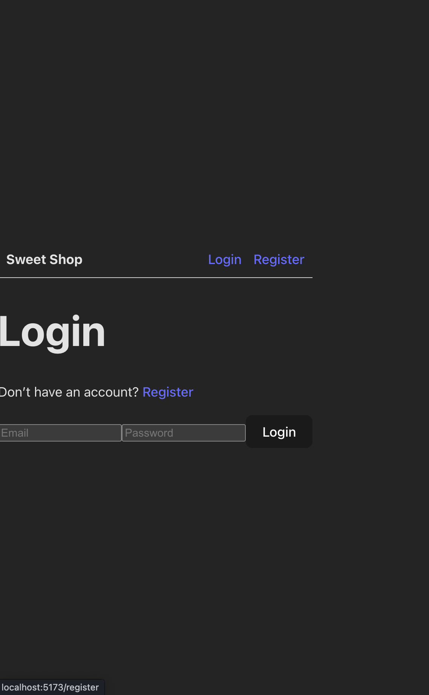
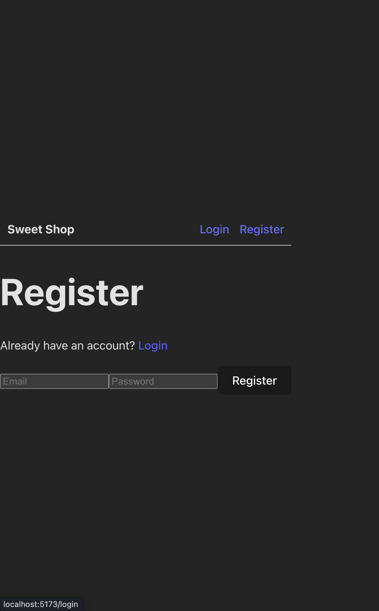
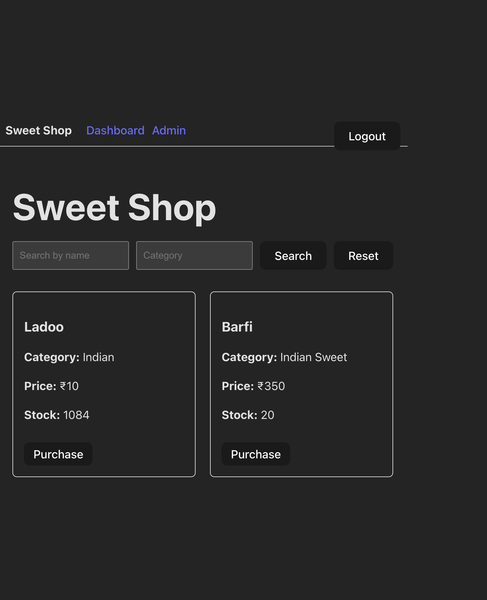
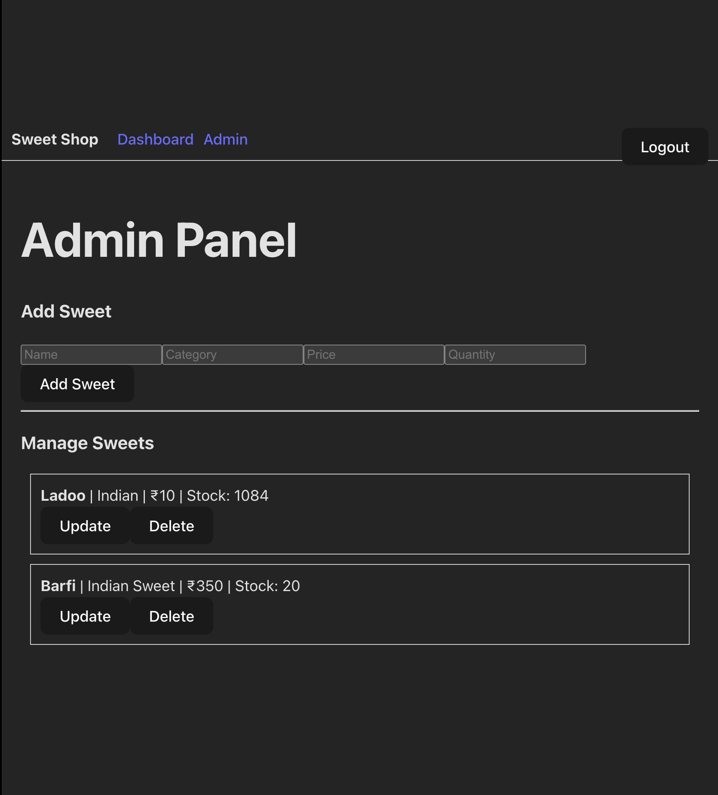

# Sweet Shop Management System

A full-stack Sweet Shop Management System built using **Node.js, MongoDB, JWT, and React**, following **Test-Driven Development (TDD)** principles.
The application allows users to browse and purchase sweets, while admins can manage inventory securely.

---

##  Project Overview

This project is developed as part of a **TDD Kata** to demonstrate:

* RESTful API development
* Authentication & authorization
* Database integration
* Frontend SPA development
* Automated testing
* Clean coding practices
* Responsible AI usage

The UI is intentionally **minimal and functional**, focusing on correctness, clarity, and maintainability.

---

##  Tech Stack

### Backend

* Node.js
* Express.js
* MongoDB (Mongoose)
* JWT (Authentication)
* bcryptjs (Password hashing)
* Jest + Supertest (Testing)

### Frontend

* React (Vite)
* React Router
* Axios
* Plain CSS / inline styles (minimal UI)

---

##  Features

### User

* Register & Login
* View available sweets
* Search sweets by name/category
* Purchase sweets (stock decreases)
* Logout

### Admin

* Add new sweets
* Update price & quantity
* Delete sweets
* Admin-only access control

---

##  API Endpoints

### Auth

* `POST /api/auth/register`
* `POST /api/auth/login`

### Sweets (Protected)

* `GET /api/sweets`
* `GET /api/sweets/search`
* `POST /api/sweets` (Admin)
* `PUT /api/sweets/:id` (Admin)
* `DELETE /api/sweets/:id` (Admin)

### Inventory

* `POST /api/sweets/:id/purchase`
* `POST /api/sweets/:id/restock` (Admin)

---

##  Testing (TDD)

* Tests written **before implementation**
* Clear **Red → Green → Refactor** workflow
* Jest used for unit & integration testing
* Supertest used for API testing

### Run tests

```bash
cd backend
npm test
```

All core backend flows (auth, CRUD, purchase) are covered.

---

##  Frontend Pages

* `/login` – User login
* `/register` – User registration
* `/` – Dashboard (view & purchase sweets)
* `/admin` – Admin panel (CRUD operations)

Routes are protected using JWT and role-based access control.

---

##  Local Setup Instructions

### 1 Backend Setup

```bash
cd backend
npm install
npm run dev
```

Server runs on:

```
http://localhost:5000
```

Ensure MongoDB is running locally.

---

### 2 Frontend Setup

```bash
cd frontend
npm install
npm run dev
```

Frontend runs on:

```
http://localhost:5173
```

---

## My AI Usage (Mandatory)

### AI Tools Used

* ChatGPT

### How AI Was Used

* Brainstorming API structure and endpoint design
* Generating initial test cases for TDD
* Debugging errors during development
* Improving code readability and structure
* Drafting documentation and README

### Reflection

AI was used as a **development assistant**, not a replacement.
All logic decisions, architecture choices, and debugging steps were **understood, verified, and implemented manually**.
AI significantly improved productivity and helped maintain clean, consistent code while following best practices.

---


##Submission Status

* ✔ Backend API complete
* ✔ Frontend SPA complete
* ✔ Authentication & roles implemented
* ✔ Tests passing
* ✔ Kata requirements fulfilled

---


## Test Report

Backend tests executed using Jest and Supertest.


## Screenshots
###  Login Page


###  Register Page


###  User Dashboard


###  Admin Panel



## 🧪 Test Report

The backend of the Sweet Shop Management System was developed using **Test-Driven Development (TDD)**.

### Testing Tools
- **Jest** – test runner
- **Supertest** – HTTP assertions for Express APIs
- **MongoDB Memory Server** – isolated database testing

### Test Coverage
The test suite validates all critical backend functionality:

#### Authentication
- User registration
- Duplicate email prevention
- Password hashing
- JWT generation and validation
- Login with valid and invalid credentials
- Protected route access control

#### Sweets Management
- Admin-only sweet creation
- Fetching all sweets (authenticated users)
- Searching sweets by name and category
- Updating sweet details (admin)
- Deleting sweets (admin)

#### Inventory Operations
- Purchasing sweets (quantity decrement)
- Preventing purchase when stock is zero
- Restocking sweets (admin-only)

### Test Results
All tests pass successfully:

```bash
npm test


##  Author

**Sumit Negi**


